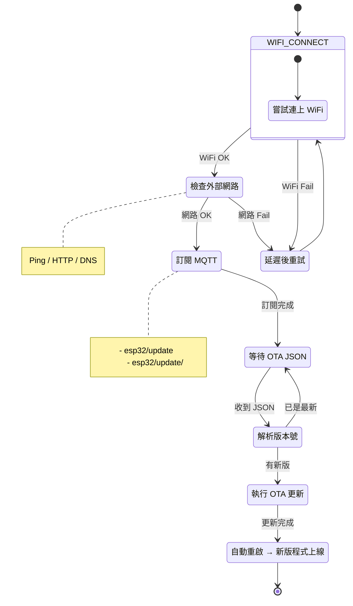

# ESP32 MQTT OTA FSM 狀態圖

```mermaid
stateDiagram-v2
    [*] --> WIFI_CONNECT

    state WIFI_CONNECT {
        [*] --> TRY_WIFI
        TRY_WIFI: 嘗試連上 WiFi
    }
    WIFI_CONNECT --> NET_CHECK: WiFi OK
    WIFI_CONNECT --> RETRY: WiFi Fail

    NET_CHECK: 檢查外部網路
    note right of NET_CHECK
      Ping / HTTP / DNS
    end note
    NET_CHECK --> MQTT_SUB: 網路 OK
    NET_CHECK --> RETRY: 網路 Fail

    MQTT_SUB: 訂閱 MQTT
    note right of MQTT_SUB
      - esp32/update  
      - esp32/update/<device_id>
    end note
    MQTT_SUB --> WAIT_OTA: 訂閱完成

    WAIT_OTA: 等待 OTA JSON
    WAIT_OTA --> PARSE_JSON: 收到 JSON

    PARSE_JSON: 解析版本號
    PARSE_JSON --> OTA_UPDATE: 有新版
    PARSE_JSON --> WAIT_OTA: 已是最新

    OTA_UPDATE: 執行 OTA 更新
    OTA_UPDATE --> REBOOT: 更新完成

    REBOOT: 自動重啟 → 新版程式上線
    REBOOT --> [*]

    RETRY: 延遲後重試
    RETRY --> WIFI_CONNECT
```
